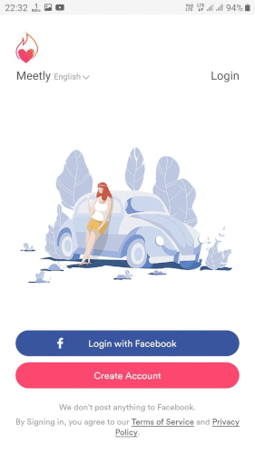

# Team_Purple 
We are cloning the Meetly app ! 

This project is a part of Unit Evaluation and Curriculam part of masai School.

We are cloning this app [Meetly](https://play.google.com/store/apps/details?id=com.improverllc.meetly&hl=en_IN&gl=US) Checkout Here

Original App | #Cloned App
 --- | --- 
  | 

This Project is made in Java Language with Android Studio IDE. We have used the core Java and some third party dependency as mentioned below
Dependency Used 
- [Circular View](https://github.com/hdodenhof/CircleImageView) 
- [icons Used](https://www.flaticon.com/)
- All Random images available on Internet ( if any Images and Icon is not credited please email me and i will make sure to give you credit thank you :) Email tejeetm@gmail.com )

Team Members 
- [Tejeet Magar](https://tejeet.com/)
- Madhuri Patel
- Shivhari Banait
